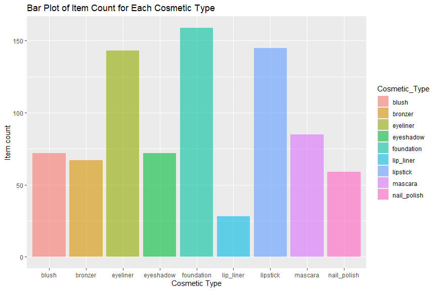
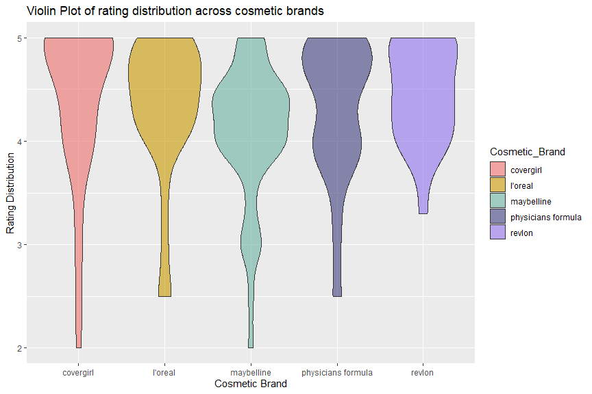
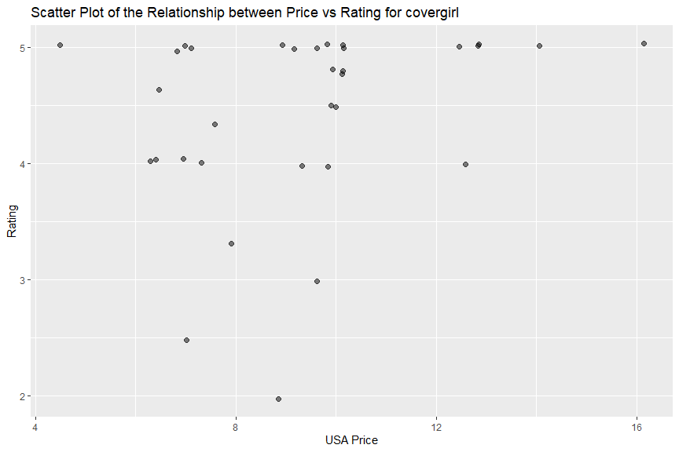
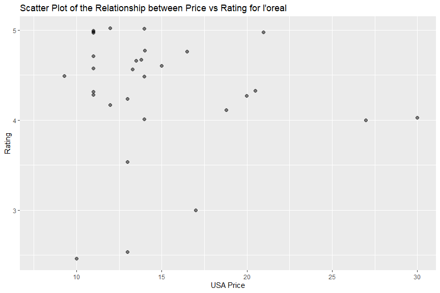
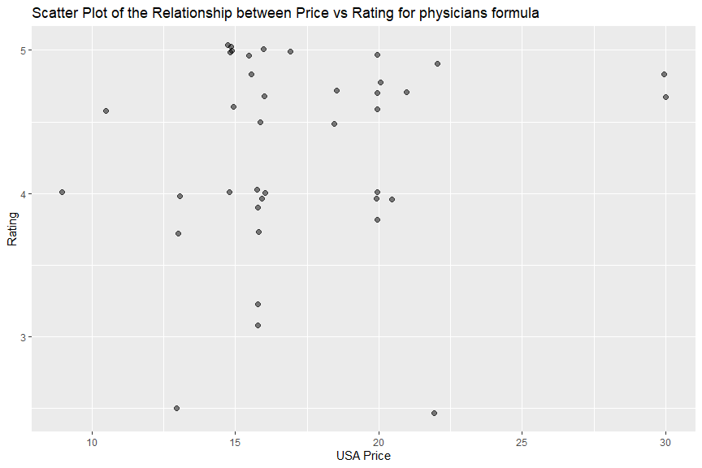
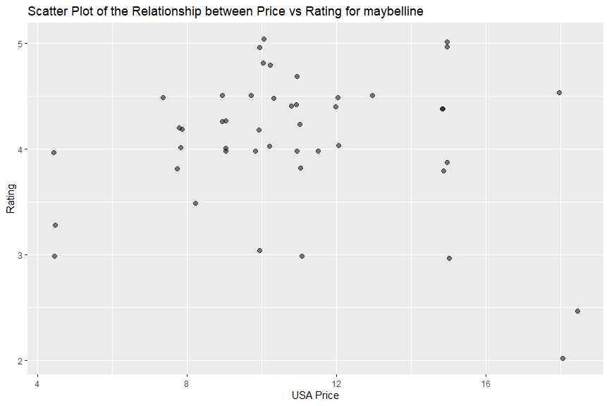
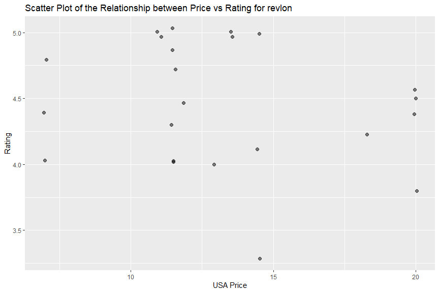
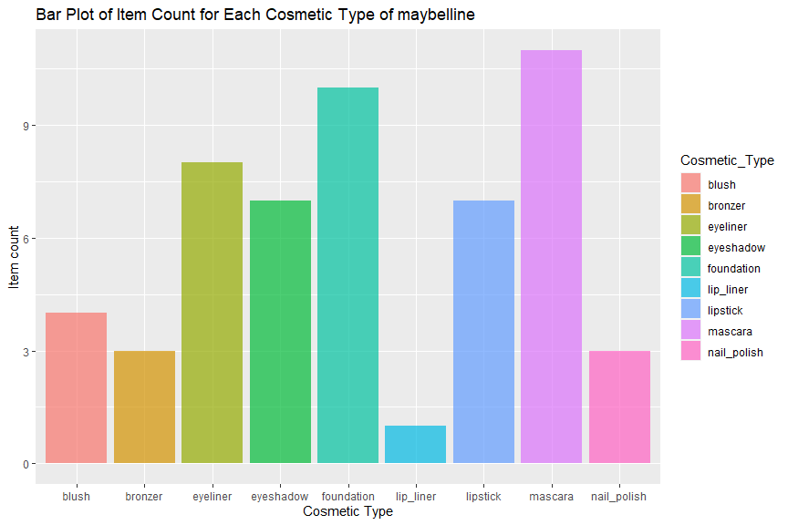
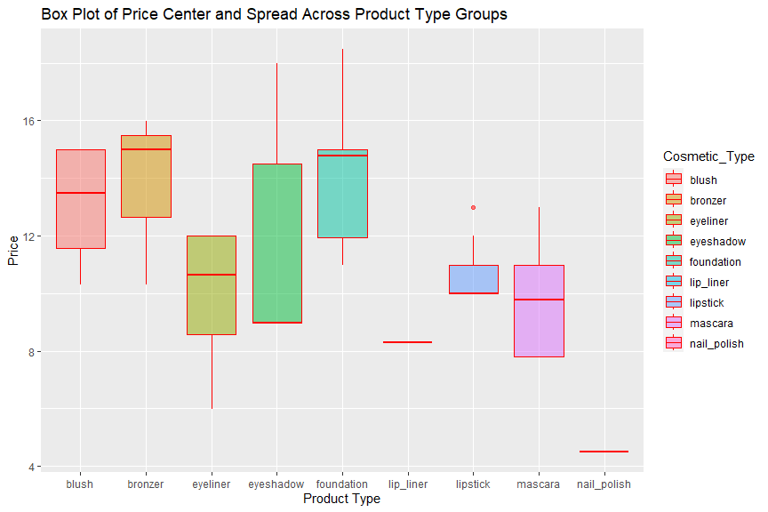

Project 2
================
Vivi Feathers
2023-10-03

- [Overwiew](#overwiew)
- [Requirement and Packages.](#requirement-and-packages)
- [API Interaction Functions](#api-interaction-functions)
- [Exploratory Data Analysis (EDA)](#exploratory-data-analysis-eda)
  - [Create a two-way contingency table and see how many items each
    brand
    has](#create-a-two-way-contingency-table-and-see-how-many-items-each-brand-has)
  - [Create a stacked bar graph to present item count for each product
    type](#create-a-stacked-bar-graph-to-present-item-count-for-each-product-type)
  - [Find measures of center and spread for price by cosmetic
    types.](#find-measures-of-center-and-spread-for-price-by-cosmetic-types)
  - [Violin plot for rating distribution across cosmetic
    brands](#violin-plot-for-rating-distribution-across-cosmetic-brands)
  - [Create scatterplots relating usa_price
    rating](#create-scatterplots-relating-usa_price-rating)
  - [Create a stacked bar graph to present item count for each product
    type](#create-a-stacked-bar-graph-to-present-item-count-for-each-product-type-1)
  - [Find measures of center and spread for rating by product
    types.](#find-measures-of-center-and-spread-for-rating-by-product-types)
    - [create a boxplot for price across product type
      groups.](#create-a-boxplot-for-price-across-product-type-groups)

# Overwiew

This vignette is created for exploring makeup items, their brand, name,
price, rating…

# Requirement and Packages.

``` r
library(tidyverse)
library(jsonlite)
library(dplyr)
```

# API Interaction Functions

``` r
 pick_makeup <- function(makeup_brand = NULL, makeup_type = NULL){
  
  # set up the base URL
  api_url <- "http://makeup-api.herokuapp.com/api/v1/products.json?"
  
  #set up brand and type option pool
  brand_base <- c("benefit", "dior", "covergirl", "maybelline", "smashbox", "nyx", "clinique")
  type_base <- c("lipstick", "foundation", "eyeliner", "eyeshadow", "mascara", "blush")
  
  # check the input values 
  if (!is.null(makeup_brand)){
    # makeup brand must be a characters string, if not, stop the function and return message.
    if (!is.character(makeup_brand)){
      stop("makeup brand must be a character string.")
    }
    # makeup brand must be selected from the brand pool, if not, stop the function and return message.
    makeup_brand <- tolower(makeup_brand)
    if (! (makeup_brand %in% brand_base)){
      stop("makeup brand must be selected from benefit, dior, covergirl, maybelline, smashbox, nyx and clinique.")
    }
    # if makeup_brand is not missing, it is a character string that from the brand pool, paste it into base url.
    api_url <- paste0(api_url, "brand=", makeup_brand)
  } # if makeup_brand is missing, leave "brand=" piece empty in the url 
  else{api_url <- paste0(api_url, "brand=")}
  
  if (!is.null(makeup_type)){
    # makeup type must be a characters string, if not, stop the function and return message.
    if (!is.character(makeup_type)){
      stop("makeup type must be a character string.")
    }
    # makeup type must be selected from the type pool, if not, stop the function and return message.
    makeup_type <- tolower(makeup_type)
    if (! (makeup_type %in% type_base)){
      stop("makeup type must be selected from lipstick, foundation, eyeliner, eyeshadow, mascara, blush.")
    }
    # if makeup_type is not missing, it is a character string that from the type pool, paste it into base url.
    api_url <- paste0(api_url, "&product_type=", makeup_type)
  }# if makeup_type is missing, the "api_url" remains unchanged
  
# use `fromJSON` function to get data frame from the "api_url" we just set up and name it as "target"
target <- fromJSON(api_url)

# create a data cleaning function that removes confusing columns, keep records with non-missing price, removes carriage returns 
# from the description column, convert price to numeric values, standardized them as US dollars according to currency name.
clean_data <- function(df){
             df%>%
             select(brand, name, product_type, price, currency, rating, description, image_link) %>%
             filter (is.na(target$price) == FALSE & target$price != "0.0") %>%
             mutate(description = gsub("[\r\n]", "", description),
                    usd_price = if_else(is.na(currency) == TRUE, round(as.numeric(price)*1, digits =2),
                                   if_else(currency == "GBP", round(as.numeric(price)*1.22, digits =2),
                                        if_else(currency == "USD", round(as.numeric(price)*1, digits =2),
                                             if_else(currency == "CAD", round(as.numeric(price)*0.73, digits =2), 0)))))
}
# clean the raw "target" data frame by calling the "clean_data" function
target_clean <- clean_data(target)
# if makeup_type is missing, after getting cleaned by "clean_data" function and dropping the original price and 
# currency columns, "target_final" is the final data frame that will be returned

if (is.null(makeup_type)){
  target_final <- target_clean %>%
                    select(brand, name, product_type, usd_price, rating, description, image_link)
  return(target_final)
}
# if makeup_type is not missing,create an api url that grabs all the data from the same makeup type, summarize the price
# statistics (mean, median, 25th and 75th percentile) and the rating statistics (mean, median, 25th and 75th percentile).
# compare the price and rating of each observation from the "target_clean" data frame vs the price summary and rating summary
# from the same type product.
else {
  all_type_url <- paste0(api_url,"brand=&product_type=", makeup_type)
  # use `fromJSON` function to get data frame from the "all_type_url" we just set up and name it as "all_type"
  all_type <- fromJSON(all_type_url)
  # clean the raw "all_type" data frame by calling the "clean_data" function
  all_type_clean <- clean_data(all_type)
  #calculate the price statistics (mean, median, 25th and 75th percentile)
  type_price_avg <- mean(all_type_clean$usd_price)
  type_price_q1 <- quantile(all_type_clean$usd_price, probs = 0.25)
  type_price_q3 <- quantile(all_type_clean$usd_price, probs = 0.75)
  type_price_median <- median(all_type_clean$usd_price)

 # remove the missing values from rating, convert it to numeric 
 #and calculate the rating statistics (mean, median, 25th and 75th percentile)
 rate <- na.omit(all_type_clean$rating)%>%
          as.numeric()
 type_rate_avg <- mean(rate)
 type_rate_q1 <- quantile(rate, probs = 0.25)
 type_rate_q3 <- quantile(rate, probs = 0.75)
 type_rate_median <- median(rate)


 target2 <- target_clean %>%
            mutate(comp_mean = if_else(usd_price > type_price_avg, "higher than",
                                       if_else(usd_price < type_price_avg, "lower than",
                                               if_else(usd_price == type_price_avg, "equal to", ""))),
                   comp_median = if_else(usd_price > type_price_median, "higher than",
                                       if_else(usd_price < type_price_median, "lower than",
                                               if_else(usd_price == type_price_median, "equal to", ""))),
                   comp_q1 = if_else(usd_price > type_price_q1, "higher than",
                                         if_else(usd_price < type_price_q1, "lower than",
                                                 if_else(usd_price == type_price_q1, "equal to", ""))),
                   comp_q3 = if_else(usd_price > type_price_q3, "higher than",
                                     if_else(usd_price < type_price_q3, "lower than",
                                             if_else(usd_price == type_price_q3, "equal to", ""))),
                   comp_rt_mean =  if_else(as.numeric(rating) > type_rate_avg, "higher than",
                                       if_else(as.numeric(rating) < type_rate_avg, "lower than",
                                               if_else(as.numeric(rating) == type_rate_avg, "equal to", ""))),
                   comp_rt_median = if_else(as.numeric(rating) > type_rate_median, "higher than",
                                         if_else(as.numeric(rating) < type_rate_median, "lower than",
                                                 if_else(as.numeric(rating) == type_rate_median, "equal to", ""))),
                   comp_rt_q1 = if_else(as.numeric(rating) > type_rate_q1, "higher than",
                                     if_else(as.numeric(rating) < type_rate_q1, "lower than",
                                             if_else(as.numeric(rating) == type_rate_q1, "equal to", ""))),
                   comp_rt_q3 = if_else(as.numeric(rating) > type_rate_q3, "higher than",
                                     if_else(as.numeric(rating) < type_rate_q3, "lower than",
                                             if_else(as.numeric(rating) == type_rate_q3, "equal to", ""))))
  target3 <- target2 %>%
             mutate(price_stat = paste0("This ", product_type, "'s price is $", usd_price, " which is ", comp_mean,
                                        " the overall ", product_type, " price mean (", round(type_price_avg, digits=2), "), ", comp_median,
                                        " the price median(", round(type_price_median, digits=2),"), ", comp_q1,
                                        " the 25th percentile(", round(type_price_q1, digits=2),"), and ", comp_q3,
                                        " the 75th percentile(", round(type_price_q3, digits=2),")."),
                    rating_stat = if_else(is.na(rating)==TRUE, "No rating",
                                          paste0("This ", product_type, "'s rating is ", rating, " which is ", comp_rt_mean,
                                        " the overall ", product_type, " rating mean (", round(type_rate_avg, digits=2), "), ", comp_rt_median,
                                        " the rating median(", round(type_rate_median, digits=2),"), ", comp_rt_q1,
                                        " the 25th percentile(", round(type_rate_q1, digits=2),"), and ", comp_rt_q3,
                                        " the 75th percentile(", round(type_rate_q3, digits=2),").")))
  target_final <- target3 %>%
                  select(brand, name, product_type, usd_price, price_stat, rating, rating_stat, description, image_link)
  return(target_final)
}

 }
```

# Exploratory Data Analysis (EDA)

``` r
# call the function and return all the data
all <- pick_makeup(makeup_brand = NULL, makeup_type = NULL)
all
```

    ## # A tibble: 877 × 7
    ##    brand     name                 product_type usd_price rating description                                 image_link
    ##    <chr>     <chr>                <chr>            <dbl>  <dbl> <chr>                                       <chr>     
    ##  1 colourpop Lippie Pencil        lip_liner         3.65     NA "Lippie Pencil A long-wearing and high-int… https://c…
    ##  2 colourpop Blotted Lip          lipstick          4.02     NA "Blotted Lip Sheer matte lipstick that cre… https://c…
    ##  3 colourpop Lippie Stix          lipstick          4.02     NA "Lippie Stix Formula contains Vitamin E, M… https://c…
    ##  4 colourpop No Filter Foundation foundation        8.76     NA "Developed for the Selfie Age, our buildab… https://c…
    ##  5 boosh     Lipstick             lipstick         19.0      NA "All of our products are free from lead an… https://c…
    ##  6 deciem    Serum Foundation     foundation        4.89     NA "Serum Foundations are lightweight medium-… https://3…
    ##  7 deciem    Coverage Foundation  foundation        5.04     NA "Coverage Foundations are full-coverage fo… https://3…
    ##  8 alva      Liquid Eye Shadow    eyeshadow         9.95     NA "Our Liquid Edition Eye Shadows have been … http://ww…
    ##  9 glossier  Stretch Concealer    foundation       22        NA "A traditional concealer sets to a stiff, … https://s…
    ## 10 glossier  Cloud Paint          blush            22        NA "With Cloud Paint, we set out to make blus… https://s…
    ## # ℹ 867 more rows

``` r
# write a function to convert "brand" and "product_type" to factors
add_factor <- function(df_1) {
                    df_1 %>%
                       mutate(Cosmetic_Brand = as.factor(df_1$brand), Cosmetic_Type = as.factor(df_1$product_type))
}

all_factor <- add_factor(all)
all_factor
```

    ## # A tibble: 877 × 9
    ##    brand     name                 product_type usd_price rating description    image_link Cosmetic_Brand Cosmetic_Type
    ##    <chr>     <chr>                <chr>            <dbl>  <dbl> <chr>          <chr>      <fct>          <fct>        
    ##  1 colourpop Lippie Pencil        lip_liner         3.65     NA "Lippie Penci… https://c… colourpop      lip_liner    
    ##  2 colourpop Blotted Lip          lipstick          4.02     NA "Blotted Lip … https://c… colourpop      lipstick     
    ##  3 colourpop Lippie Stix          lipstick          4.02     NA "Lippie Stix … https://c… colourpop      lipstick     
    ##  4 colourpop No Filter Foundation foundation        8.76     NA "Developed fo… https://c… colourpop      foundation   
    ##  5 boosh     Lipstick             lipstick         19.0      NA "All of our p… https://c… boosh          lipstick     
    ##  6 deciem    Serum Foundation     foundation        4.89     NA "Serum Founda… https://3… deciem         foundation   
    ##  7 deciem    Coverage Foundation  foundation        5.04     NA "Coverage Fou… https://3… deciem         foundation   
    ##  8 alva      Liquid Eye Shadow    eyeshadow         9.95     NA "Our Liquid E… http://ww… alva           eyeshadow    
    ##  9 glossier  Stretch Concealer    foundation       22        NA "A traditiona… https://s… glossier       foundation   
    ## 10 glossier  Cloud Paint          blush            22        NA "With Cloud P… https://s… glossier       blush        
    ## # ℹ 867 more rows

## Create a two-way contingency table and see how many items each brand has

``` r
two_way <- table( all_factor$Cosmetic_Type,all_factor$Cosmetic_Brand)
two_way
```

    ##              
    ##               almay alva anna sui annabelle benefit boosh burt's bees butter london cargo cosmetics china glaze
    ##   blush           1    0        1         1       0     0           0             0               3           0
    ##   bronzer         1    0        0         1       6     0           0             0               9           0
    ##   eyebrow         0    0        0         0      11     0           0             0               0           0
    ##   eyeliner        3    0        3         7       3     0           0             0               2           0
    ##   eyeshadow       2    1        0         0       0     0           0             0               1           0
    ##   foundation      3    0        0         1       2     0           0             0               2           0
    ##   lip_liner       0    0        0         1       0     0           0             0               1           0
    ##   lipstick        1    0        1         0      13     1           2             1               2           0
    ##   mascara         3    0        0         0       6     0           0             0               0           0
    ##   nail_polish     0    0        1         0       0     0           0             1               0           1
    ##              
    ##               clinique colourpop covergirl dalish deciem dior dr. hauschka e.l.f. essie fenty glossier l'oreal
    ##   blush              7         0         7      0      0    4            0      2     0     0        1       2
    ##   bronzer            5         0         2      0      0    1            3      5     0     0        0       1
    ##   eyebrow            6         0         0      0      0    5            0      0     0     0        0       0
    ##   eyeliner           9         0        12      0      0    6            2      4     0     1        0       9
    ##   eyeshadow         12         0         5      0      0   10            2      6     0     0        0       1
    ##   foundation        34         1        10      0      2    9            2      3     0     2        4       7
    ##   lip_liner          2         1         1      0      0    0            0      1     0     0        0       2
    ##   lipstick          17         2         4      1      0   15            2      3     0     2        1       7
    ##   mascara            0         0        12      0      0    8            1      3     0     0        0       8
    ##   nail_polish        0         0         1      0      0   13            0      0     4     0        0       9
    ##              
    ##               marcelle maybelline milani mineral fusion misa mistura moov nyx orly pacifica physicians formula
    ##   blush              1          4      2              1    0       0    0  12    0        1                  8
    ##   bronzer            2          3      1              1    0       0    0   9    0        1                  9
    ##   eyebrow            0          0      0              0    0       0    0  18    0        0                  0
    ##   eyeliner           4          8      5              1    0       0    0  32    0        1                  9
    ##   eyeshadow          1          7      1              0    0       1    0   1    0        4                  3
    ##   foundation         2         10      1              2    0       0    0  32    0        0                  8
    ##   lip_liner          3          1      1              0    0       0    0  10    0        1                  0
    ##   lipstick           1          7      2              1    0       0    0  38    0        1                  0
    ##   mascara            1         11      0              1    0       0    0  11    0        2                  6
    ##   nail_polish        0          3      0              1    1       0    3   0    4        2                  0
    ##              
    ##               piggy paint pure anada revlon salon perfect sante sinful colours smashbox stila suncoat wet n wild
    ##   blush                 0          3      2             0     1              0        3     2       0          0
    ##   bronzer               0          1      0             0     0              0        2     1       0          0
    ##   eyebrow               0          0      0             0     0              0        7     0       0          0
    ##   eyeliner              0          1      4             0     1              0        6     1       1          5
    ##   eyeshadow             0          2      1             0     1              0        7     0       0          3
    ##   foundation            0          4      7             0     1              0        9     0       0          0
    ##   lip_liner             0          0      1             0     1              0        0     0       0          0
    ##   lipstick              0          1     11             0     0              0        6     0       0          2
    ##   mascara               0          1      0             0     0              0        6     0       1          1
    ##   nail_polish           1          3      3             1     1              1        0     0       4          1
    ##              
    ##               zorah
    ##   blush           0
    ##   bronzer         0
    ##   eyebrow         0
    ##   eyeliner        1
    ##   eyeshadow       0
    ##   foundation      0
    ##   lip_liner       0
    ##   lipstick        0
    ##   mascara         1
    ##   nail_polish     0

## Create a stacked bar graph to present item count for each product type

use `gglot` and `geom_bar` to create a stacked bar graph

``` r
library(ggplot2)
g <- ggplot(data = all_factor, aes(x = Cosmetic_Type, fill = Cosmetic_Type))
  g + geom_bar(alpha = 0.6) +
  labs(x = "Cosmetic Type", y = "Item count", title = "Bar Plot of Item Count for Each Cosmetic Type") 
```

<!-- -->

## Find measures of center and spread for price by cosmetic types.

I will write a get use price mean, standard deviation, variance, median
and IQR by costmetic type groups.

``` r
 all_factor %>%
                   group_by(Cosmetic_Type) %>%
                   summarise(Mean = mean(usd_price),  Standard_Deviation = sd(usd_price), 
                             Variance = var(usd_price), Median = median(usd_price), 
                             q1 = quantile(usd_price, probs = 0.25),
                             q3 = quantile(usd_price, probs = 0.75))
```

    ## # A tibble: 10 × 7
    ##    Cosmetic_Type  Mean Standard_Deviation Variance Median    q1    q3
    ##    <fct>         <dbl>              <dbl>    <dbl>  <dbl> <dbl> <dbl>
    ##  1 blush          18.5              10.8     117.   15.2   9.99  24.1
    ##  2 bronzer        23.5              13.9     194.   21.0  11.2   32  
    ##  3 eyebrow        22.0              14.0     195.   21     9.88  30  
    ##  4 eyeliner       13.2               6.88     47.4  11     8     17.0
    ##  5 eyeshadow      22.2              16.3     267.   17.7   9.98  28  
    ##  6 foundation     21.4              11.4     129.   20.0  12     28  
    ##  7 lip_liner      10.2               5.16     26.6   9.99  4.99  13.0
    ##  8 lipstick       15.9              11.0     121.   12     8     21  
    ##  9 mascara        15.4               8.54     72.9  13.0   9     22  
    ## 10 nail_polish    14.1               7.25     52.6  11.0   8.14  22.2

## Violin plot for rating distribution across cosmetic brands

``` r
#filter to 6 brands that have most non-missing rating
five_brand <- all_factor %>%
              filter(Cosmetic_Brand %in% c("l'oreal", "physicians formula", "covergirl", "maybelline", "revlon"))

p <- ggplot(data = five_brand, aes(x = Cosmetic_Brand, y = rating, fill = Cosmetic_Brand))
p + geom_violin(alpha = 0.6) +
scale_fill_manual(values=c("#EF6F6A", "#cc9900", "#69b3a2", "#404080", "#9172EC")) +
labs(x = "Cosmetic Brand", y = "Rating Distribution", title = "Violin Plot of rating distribution across cosmetic brands") 
```

<!-- -->

## Create scatterplots relating usa_price rating

``` r
  split <- function(br) {
        a <- five_brand %>%
              filter(Cosmetic_Brand == br)
  s <- ggplot(data = a, aes(y = rating, x = usd_price))
  s + geom_point( alpha = 0.5, size = 2, position = "jitter") +
  labs(y = "Rating", x="USA Price", title = paste0("Scatter Plot of the Relationship between Price vs Rating for brand ",br))}

split(quote(covergirl))
```

<!-- -->

``` r
split(quote("l'oreal"))
```

<!-- -->

``` r
split(quote("physicians formula"))
```

<!-- -->

``` r
split(quote(maybelline))
```

<!-- -->

``` r
split(quote(revlon))
```

<!-- --> \## Call the API
function again and get a subset data frame with only maybelline cosmetic
products

``` r
# call the function and return a subset data frame with only maybelline cosmetic products
mbl <- pick_makeup(makeup_brand = "maybelline", makeup_type = NULL)
mbl
```

    ## # A tibble: 54 × 7
    ##    brand      name                                                product_type usd_price rating description image_link
    ##    <chr>      <chr>                                               <chr>            <dbl>  <dbl> <chr>       <chr>     
    ##  1 maybelline "Maybelline Face Studio Master Hi-Light Light Boos… bronzer          15.0     5   "Maybellin… https://d…
    ##  2 maybelline "Maybelline Fit Me Bronzer"                         bronzer          10.3     4.5 "Why You'l… https://d…
    ##  3 maybelline "Maybelline Facestudio Master Contour Kit"          bronzer          16.0    NA   "Maybellin… https://d…
    ##  4 maybelline "Maybelline Face Studio Master Hi-Light Light Boos… blush            15.0    NA   "Maybellin… https://d…
    ##  5 maybelline "Maybelline Face Studio Master Hi-Light Light Boos… blush            15.0     5   "Maybellin… https://d…
    ##  6 maybelline "Maybelline Fit Me Blush"                           blush            10.3     4.8 "Maybellin… https://d…
    ##  7 maybelline "Maybelline Dream Bouncy Blush"                     blush            12.0     4.5 "Now, blus… https://d…
    ##  8 maybelline "Maybelline Color Sensational Lipliner"             lip_liner         8.29    3.5 "Keep your… https://d…
    ##  9 maybelline "Maybelline Dream Smooth Mousse Foundation"         foundation       14.8     3.8 "Why You'l… https://d…
    ## 10 maybelline "Maybelline Fit Me Shine-Free Foundation Stick"     foundation       11.0     4.7 "Get flawl… https://d…
    ## # ℹ 44 more rows

``` r
mbl_factor <- add_factor(mbl)
mbl_factor
```

    ## # A tibble: 54 × 9
    ##    brand      name                   product_type usd_price rating description image_link Cosmetic_Brand Cosmetic_Type
    ##    <chr>      <chr>                  <chr>            <dbl>  <dbl> <chr>       <chr>      <fct>          <fct>        
    ##  1 maybelline "Maybelline Face Stud… bronzer          15.0     5   "Maybellin… https://d… maybelline     bronzer      
    ##  2 maybelline "Maybelline Fit Me Br… bronzer          10.3     4.5 "Why You'l… https://d… maybelline     bronzer      
    ##  3 maybelline "Maybelline Facestudi… bronzer          16.0    NA   "Maybellin… https://d… maybelline     bronzer      
    ##  4 maybelline "Maybelline Face Stud… blush            15.0    NA   "Maybellin… https://d… maybelline     blush        
    ##  5 maybelline "Maybelline Face Stud… blush            15.0     5   "Maybellin… https://d… maybelline     blush        
    ##  6 maybelline "Maybelline Fit Me Bl… blush            10.3     4.8 "Maybellin… https://d… maybelline     blush        
    ##  7 maybelline "Maybelline Dream Bou… blush            12.0     4.5 "Now, blus… https://d… maybelline     blush        
    ##  8 maybelline "Maybelline Color Sen… lip_liner         8.29    3.5 "Keep your… https://d… maybelline     lip_liner    
    ##  9 maybelline "Maybelline Dream Smo… foundation       14.8     3.8 "Why You'l… https://d… maybelline     foundation   
    ## 10 maybelline "Maybelline Fit Me Sh… foundation       11.0     4.7 "Get flawl… https://d… maybelline     foundation   
    ## # ℹ 44 more rows

## Create a stacked bar graph to present item count for each product type

use `gglot` and `geom_bar` to create a stacked bar graph

``` r
q <- ggplot(data = mbl_factor, aes(x = Cosmetic_Type, fill = Cosmetic_Type))
  q + geom_bar(alpha = 0.7) +
  labs(x = "Cosmetic Type", y = "Item count", title = "Bar Plot of Item Count for Each Cosmetic Type of maybelline") 
```

<!-- -->

## Find measures of center and spread for rating by product types.

I will write a get rating mean, standard deviation, variance, median and
IQR by costmetic type groups.

``` r
 mbl_factor %>%
            filter(is.na(rating) == FALSE) %>%
                   group_by(Cosmetic_Type) %>%
                   summarise(Mean = mean(rating),  Standard_Deviation = sd(rating), 
                             Variance = var(rating), Median = median(rating), 
                             q1 = quantile(rating, probs = 0.25),
                             q3 = quantile(rating, probs = 0.75))
```

    ## # A tibble: 9 × 7
    ##   Cosmetic_Type  Mean Standard_Deviation Variance Median    q1    q3
    ##   <fct>         <dbl>              <dbl>    <dbl>  <dbl> <dbl> <dbl>
    ## 1 blush          4.77              0.252   0.0633   4.8   4.65  4.9 
    ## 2 bronzer        4.75              0.354   0.125    4.75  4.62  4.88
    ## 3 eyeliner       4.23              0.207   0.0427   4.25  4.05  4.38
    ## 4 eyeshadow      3.76              0.929   0.863    4     3.5   4.4 
    ## 5 foundation     3.88              0.722   0.522    3.9   3.8   4.4 
    ## 6 lip_liner      3.5              NA      NA        3.5   3.5   3.5 
    ## 7 lipstick       4.4               0.849   0.72     4.8   4.2   5   
    ## 8 mascara        4.16              0.241   0.0582   4.1   4     4.35
    ## 9 nail_polish    3.43              0.513   0.263    3.3   3.15  3.65

### create a boxplot for price across product type groups.

``` r
  b <- ggplot(data = mbl_factor, aes(y = usd_price, x = Cosmetic_Type, fill=Cosmetic_Type))
  b + geom_boxplot(adjust = 0.5, color="#e9ecef", alpha=0.5) +
  labs(y = "Price", x="Product Type", title = "Box Plot of Price Center and Spread Across Product Type Groups") 
```

<!-- -->
