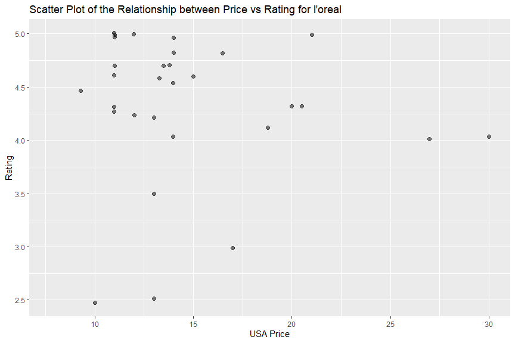

Cosmetic API Vignette
================
Vivi Feathers
2023-10-03

- [Requirement](#requirement)
- [API Interaction Functions](#api-interaction-functions)
  - [`clean_data`](#clean_data)
  - [`price_sum` and `rating_sum`](#price_sum-and-rating_sum)
  - [`pick_makeup`](#pick_makeup)
- [Exploratory Data Analysis (EDA)](#exploratory-data-analysis-eda)
  - [First call](#first-call)
    - [Two-way contingency table](#two-way-contingency-table)
    - [Create a stacked bar graph to present item count for each product
      type](#create-a-stacked-bar-graph-to-present-item-count-for-each-product-type)
    - [Find measures of center and spread for price by cosmetic
      types.](#find-measures-of-center-and-spread-for-price-by-cosmetic-types)
    - [Violin plot for rating distribution across cosmetic
      brands](#violin-plot-for-rating-distribution-across-cosmetic-brands)
    - [Create scatterplots relating usa_price
      rating](#create-scatterplots-relating-usa_price-rating)
  - [Second call](#second-call)
    - [Create a stacked bar graph to present item count for each product
      type](#create-a-stacked-bar-graph-to-present-item-count-for-each-product-type-1)
    - [Find measures of center and spread for rating by product
      types.](#find-measures-of-center-and-spread-for-rating-by-product-types)
    - [create a boxplot for price across product type
      groups.](#create-a-boxplot-for-price-across-product-type-groups)
- [Wrap up](#wrap-up)

This document is a vignette with the purpose of exploring how to read in
data using a function created for interacting with a specific API, as
well as showing different types of data analyses that can be conducted
on the data obtained.

I’ll be demonstrating with the [*MAKEUP
API*](http://makeup-api.herokuapp.com/) which contains cosmetic items’
name, brand, type, price and rating. I’m going to build a few functions
to interact with 2 endpoints: **product brand and product type**.

I will also summarize the statistics of price and rating by product type
with all the data available. After data are fetched and cleaned based on
the brand and/or type selected, I will merge the summaries with the
fetched data and compare each item’s price and rating verse price and
rating summaries from the corresponding product type, thus the user may
have some ideas about whether to choose this item or not.

The second part of the vignette focus on data exploration, I will
investigate cosmetic items’ brand, type, price and rating by creating
some contingency tables, numerical summaries and couple of plots.

# Requirement

The following packages were used to create this document:

- `tidyverse`: used for data manipulation, piping and visualization  
- `jsonlite`: used for interacting with JSON in the API and returning
  data in data frame  
- `knitr`: used to manage code in R Markdown format

# API Interaction Functions

## `clean_data`

I created a data cleaning function that removes confusing columns and
keep brand, name, product_type, price, currency, rating, description,
image_link columns. It also omits records with missing price or 0.0 as
price value, removes carriage returns from the name and description
column. Additionally, it converts price to numeric values, rounds them
to two decimal places and standardizes them as US dollars according to
their currency name.(CAD*0.73, GBP*1.22, and if currency is missing, I
take it as USD by default).

``` r
# create a data cleaning function that removes confusing columns, keep records with non-missing price, 
# removes carriage returns,converts price to numeric values, standardized them as US dollars according to 
# currency name.

clean_data <- function(df){
    df%>%
      select(brand, name, product_type, price, currency, rating, description, image_link) %>%
      filter (is.na(price) == FALSE & price != "0.0") %>%
      mutate(description = gsub("[\r\n]", "", description),
             name = gsub("[\r\n]", "", name),
             usd_price = if_else(is.na(currency) == TRUE, round(as.numeric(price)*1, digits =2),
                                 if_else(currency == "GBP", round(as.numeric(price)*1.22, digits =2),
                                         if_else(currency == "USD", round(as.numeric(price)*1, digits =2),
                                                 if_else(currency == "CAD", round(as.numeric(price)*0.73, digits =2), 0)))))
  }
```

## `price_sum` and `rating_sum`

I grabbed all the available data by calling the base URL in `fromJSON`
function. After cleaned the raw “all_type” data frame by using the
“clean_data” function. I summarized the price statistics (mean, median,
25th and 75th percentile) across product type. Then I removed the
missing values from rating and calculated the rating statistics (mean,
median, 25th and 75th percentile) by product type as well, At the end, I
stored the results into two data frames: `price_sum` and `rating_sum`.

``` r
# use `fromJSON` function to get data frame from the base url and name it as "all_type"

all_type <- fromJSON("http://makeup-api.herokuapp.com/api/v1/products.json?")

# clean the raw "all_type" data frame by calling the "clean_data" function

all_type_clean <- clean_data(all_type)

#calculate the price statistics (mean, median, 25th and 75th percentile)

price_sum <- all_type_clean %>%
               group_by(product_type) %>%
               summarise(type_price_avg = mean(usd_price),
                         type_price_q1 = quantile(usd_price, probs = 0.25),
                         type_price_q3 = quantile(usd_price, probs = 0.75),
                         type_price_median = median(usd_price))
  
# remove the missing values from rating and calculate the rating statistics
  
rating_sum <- all_type_clean %>%
                filter(is.na(all_type_clean$rating) == FALSE) %>%
                group_by(product_type) %>%
                summarise(type_rate_avg = mean(rating),
                          type_rate_q1 = quantile(rating, probs = 0.25),
                          type_rate_q3 = quantile(rating, probs = 0.75),
                          type_rate_median = median(rating))
```

## `pick_makeup`

I created an API interaction function that fetches data based on user
selected cosmetic brand or/and product type.

Step one, I set up the base URL which returns all the available data and
the brand and type pool to limit user’s selections in “benefit”, “dior”,
“covergirl”, “maybelline”, “smashbox”, “nyx”, “clinique” as cosmetic
brands and “lipstick”, “foundation”, “eyeliner”, “eyeshadow”, “mascara”,
“blush” as product types.

Step two, I checked the user’s argument input valus to make sure both
makeup_brand and makeup_type are character strings that within the brand
and type pool, otherwise the function will stop executing.After making
sure the input values are good, I paste them with the base URL to form
the API endpoints.

Step three, I used `fromJSON` function to obtain a data frame from the
“api_url” and name it as “target”.

Step four, I cleaned the raw “target” data frame by calling the
“clean_data” helper function, and stored the processed data frame in
“target_clean”.

Step five, I merged price and rating summaries from “price_sum” and
“rating_sum” data frames with “target_clean” data frame by product type.

Step six, I compared the price and rating of each observation from the
“target_clean” data frame vs the corresponding price summary and rating
summary from the same type products, and return “higher than”, “equal
to” and “less than” accordingly.

Step seven, I pasted the item price, product type, price/rating summary
and comparison results from step six together and output them into
“price_stat” and “rating_stat” column as price and rating status for
each observation.

Lastly, I returned the final data frame by keeping the necessary columns
as brand, name, product_type, usd_price, price_stat, rating,
rating_stat, description and image_link.

``` r
pick_makeup <- function(makeup_brand = NULL, makeup_type = NULL){
  
  # set up the base URL
  api_url <- "http://makeup-api.herokuapp.com/api/v1/products.json?"
  
  #set up brand and type option pool
  brand_base <- c("benefit", "dior", "covergirl", "maybelline", "smashbox", "nyx", "clinique")
  type_base <- c("lipstick", "foundation", "eyeliner", "eyeshadow", "mascara", "blush")
  
  # check the input values 
  if (!is.null(makeup_brand)){
    # makeup brand must be a characters string, if not, stop the function and return message.
    if (!is.character(makeup_brand)){
      stop("makeup brand must be a character string.")
    }
    # makeup brand must be selected from the brand pool, if not, stop the function and return message.
    makeup_brand <- tolower(makeup_brand)
    if (! (makeup_brand %in% brand_base)){
      stop("makeup brand must be selected from benefit, dior, covergirl, maybelline, smashbox, nyx and clinique.")
    }
    # if makeup_brand is not missing, it is a character string that from the brand pool, paste it into base url.
    api_url <- paste0(api_url, "brand=", makeup_brand)
  } # if makeup_brand is missing, leave "brand=" piece empty in the url 
  else{api_url <- paste0(api_url, "brand=")}
  
  if (!is.null(makeup_type)){
    # makeup type must be a characters string, if not, stop the function and return message.
    if (!is.character(makeup_type)){
      stop("makeup type must be a character string.")
    }
    # makeup type must be selected from the type pool, if not, stop the function and return message.
    makeup_type <- tolower(makeup_type)
    if (! (makeup_type %in% type_base)){
      stop("makeup type must be selected from lipstick, foundation, eyeliner, eyeshadow, mascara, blush.")
    }
    # if makeup_type is not missing, it is a character string that from the type pool, paste it into base url.
    api_url <- paste0(api_url, "&product_type=", makeup_type)
  }# if makeup_type is missing, the "api_url" remains unchanged
  
  # use `fromJSON` function to get data frame from the "api_url" we just set up and name it as "target"
  target <- fromJSON(api_url)
  
  # clean the raw "target" data frame by calling the "clean_data" function
  target_clean <- clean_data(target)
  
  # merge price and rating summaries with target data frame by product type and do the comparison
  
  target_price <- merge(target_clean, price_sum, by="product_type")
  target_price_rate <- merge( target_price, rating_sum, by="product_type")
  
  # compared the price and rating of each observation vs summaries from the same type products
  
  target2 <-  target_price_rate %>%
    mutate(comp_mean = if_else(usd_price > type_price_avg, "higher than",
                               if_else(usd_price < type_price_avg, "lower than",
                                       if_else(usd_price == type_price_avg, "equal to", ""))),
           comp_median = if_else(usd_price > type_price_median, "higher than",
                                 if_else(usd_price < type_price_median, "lower than",
                                         if_else(usd_price == type_price_median, "equal to", ""))),
           comp_q1 = if_else(usd_price > type_price_q1, "higher than",
                             if_else(usd_price < type_price_q1, "lower than",
                                     if_else(usd_price == type_price_q1, "equal to", ""))),
           comp_q3 = if_else(usd_price > type_price_q3, "higher than",
                             if_else(usd_price < type_price_q3, "lower than",
                                     if_else(usd_price == type_price_q3, "equal to", ""))),
           comp_rt_mean =  if_else(as.numeric(rating) > type_rate_avg, "higher than",
                                   if_else(as.numeric(rating) < type_rate_avg, "lower than",
                                           if_else(as.numeric(rating) == type_rate_avg, "equal to", ""))),
           comp_rt_median = if_else(as.numeric(rating) > type_rate_median, "higher than",
                                    if_else(as.numeric(rating) < type_rate_median, "lower than",
                                            if_else(as.numeric(rating) == type_rate_median, "equal to", ""))),
           comp_rt_q1 = if_else(as.numeric(rating) > type_rate_q1, "higher than",
                                if_else(as.numeric(rating) < type_rate_q1, "lower than",
                                        if_else(as.numeric(rating) == type_rate_q1, "equal to", ""))),
           comp_rt_q3 = if_else(as.numeric(rating) > type_rate_q3, "higher than",
                                if_else(as.numeric(rating) < type_rate_q3, "lower than",
                                        if_else(as.numeric(rating) == type_rate_q3, "equal to", ""))))
  
  # generate "price_stat" and "rating_stat" column by pasting the item price, product type, price/rating summary and comparison results
  
  target3 <- target2 %>%
    mutate(price_stat = paste0("This ", product_type, "'s price is $", usd_price, " which is ", comp_mean,
                               " the overall ", product_type, " price mean (", round(type_price_avg, digits=2), "), ", comp_median,
                               " the price median(", round(type_price_median, digits=2),"), ", comp_q1,
                               " the 25th percentile(", round(type_price_q1, digits=2),"), and ", comp_q3,
                               " the 75th percentile(", round(type_price_q3, digits=2),")."),
           rating_stat = if_else(is.na(rating)==TRUE, "No rating",
                                 paste0("This ", product_type, "'s rating is ", rating, " which is ", comp_rt_mean,
                                        " the overall ", product_type, " rating mean (", round(type_rate_avg, digits=2), "), ", comp_rt_median,
                                        " the rating median(", round(type_rate_median, digits=2),"), ", comp_rt_q1,
                                        " the 25th percentile(", round(type_rate_q1, digits=2),"), and ", comp_rt_q3,
                                        " the 75th percentile(", round(type_rate_q3, digits=2),").")))
  # keep necessary columns and return
  target_final <- target3 %>%
    select(brand, name, product_type, usd_price, price_stat, rating, rating_stat, description, image_link)
  return(target_final)
}
```

# Exploratory Data Analysis (EDA)

Now the API interaction function is done, I can explore some data
analysis.

## First call

First of all, let’s call the API function without argument input and
return all the available data, then convert cosmetic brand and product
type as factors, so it is better for data analysis.

``` r
# call the function and return all the data
all <- pick_makeup(makeup_brand = NULL, makeup_type = NULL)

# write a function to convert "brand" and "product_type" to factors
add_factor <- function(df_1) {
                    df_1 %>%
                       mutate(Cosmetic_Brand = as.factor(df_1$brand), Cosmetic_Type = as.factor(df_1$product_type))
}

all_factor <- add_factor(all)
```

### Two-way contingency table

Let’s use a `table` function and create a two-way contingency table and
break the item counts by brand and type.

``` r
two_way <- table( all_factor$Cosmetic_Type,all_factor$Cosmetic_Brand)
two_way
```

    ##              
    ##               almay alva anna sui annabelle benefit boosh burt's bees butter london cargo cosmetics china glaze
    ##   blush           1    0        1         1       0     0           0             0               3           0
    ##   bronzer         1    0        0         1       6     0           0             0               9           0
    ##   eyeliner        3    0        3         7       3     0           0             0               2           0
    ##   eyeshadow       2    1        0         0       0     0           0             0               1           0
    ##   foundation      3    0        0         1       2     0           0             0               2           0
    ##   lip_liner       0    0        0         1       0     0           0             0               1           0
    ##   lipstick        1    0        1         0      13     1           2             1               2           0
    ##   mascara         3    0        0         0       6     0           0             0               0           0
    ##   nail_polish     0    0        1         0       0     0           0             1               0           1
    ##              
    ##               clinique colourpop covergirl dalish deciem dior dr. hauschka e.l.f. essie fenty glossier l'oreal
    ##   blush              7         0         7      0      0    4            0      2     0     0        1       2
    ##   bronzer            5         0         2      0      0    1            3      5     0     0        0       1
    ##   eyeliner           9         0        12      0      0    6            2      4     0     1        0       9
    ##   eyeshadow         12         0         5      0      0   10            2      6     0     0        0       1
    ##   foundation        34         1        10      0      2    9            2      3     0     2        4       7
    ##   lip_liner          2         1         1      0      0    0            0      1     0     0        0       2
    ##   lipstick          17         2         4      1      0   15            2      3     0     2        1       7
    ##   mascara            0         0        12      0      0    8            1      3     0     0        0       8
    ##   nail_polish        0         0         1      0      0   13            0      0     4     0        0       9
    ##              
    ##               marcelle maybelline milani mineral fusion misa mistura moov nyx orly pacifica physicians formula
    ##   blush              1          4      2              1    0       0    0  12    0        1                  8
    ##   bronzer            2          3      1              1    0       0    0   9    0        1                  9
    ##   eyeliner           4          8      5              1    0       0    0  32    0        1                  9
    ##   eyeshadow          1          7      1              0    0       1    0   1    0        4                  3
    ##   foundation         2         10      1              2    0       0    0  32    0        0                  8
    ##   lip_liner          3          1      1              0    0       0    0  10    0        1                  0
    ##   lipstick           1          7      2              1    0       0    0  38    0        1                  0
    ##   mascara            1         11      0              1    0       0    0  11    0        2                  6
    ##   nail_polish        0          3      0              1    1       0    3   0    4        2                  0
    ##              
    ##               piggy paint pure anada revlon salon perfect sante sinful colours smashbox stila suncoat wet n wild
    ##   blush                 0          3      2             0     1              0        3     2       0          0
    ##   bronzer               0          1      0             0     0              0        2     1       0          0
    ##   eyeliner              0          1      4             0     1              0        6     1       1          5
    ##   eyeshadow             0          2      1             0     1              0        7     0       0          3
    ##   foundation            0          4      7             0     1              0        9     0       0          0
    ##   lip_liner             0          0      1             0     1              0        0     0       0          0
    ##   lipstick              0          1     11             0     0              0        6     0       0          2
    ##   mascara               0          1      0             0     0              0        6     0       1          1
    ##   nail_polish           1          3      3             1     1              1        0     0       4          1
    ##              
    ##               zorah
    ##   blush           0
    ##   bronzer         0
    ##   eyeliner        1
    ##   eyeshadow       0
    ##   foundation      0
    ##   lip_liner       0
    ##   lipstick        0
    ##   mascara         1
    ##   nail_polish     0

### Create a stacked bar graph to present item count for each product type

use `gglot` and `geom_bar` to create a stacked bar graph

``` r
library(ggplot2)
g <- ggplot(data = all_factor, aes(x = Cosmetic_Type, fill = Cosmetic_Type))
  g + geom_bar(alpha = 0.6) +
  labs(x = "Cosmetic Type", y = "Item count", title = "Bar Plot of Item Count for Each Cosmetic Type") 
```

<!-- -->

### Find measures of center and spread for price by cosmetic types.

I will write a get use price mean, standard deviation, variance, median
and IQR by cosmetic type groups.

``` r
 all_factor %>%
                   group_by(Cosmetic_Type) %>%
                   summarise(Mean = mean(usd_price),  Standard_Deviation = sd(usd_price), 
                             Variance = var(usd_price), Median = median(usd_price), 
                             q1 = quantile(usd_price, probs = 0.25),
                             q3 = quantile(usd_price, probs = 0.75))
```

    ## # A tibble: 9 × 7
    ##   Cosmetic_Type  Mean Standard_Deviation Variance Median    q1    q3
    ##   <fct>         <dbl>              <dbl>    <dbl>  <dbl> <dbl> <dbl>
    ## 1 blush          18.5              10.8     117.   15.2   9.99  24.1
    ## 2 bronzer        23.5              13.9     194.   21.0  11.2   32  
    ## 3 eyeliner       13.2               6.88     47.4  11     8     17.0
    ## 4 eyeshadow      22.2              16.3     267.   17.7   9.98  28  
    ## 5 foundation     21.4              11.4     129.   20.0  12     28  
    ## 6 lip_liner      10.2               5.16     26.6   9.99  4.99  13.0
    ## 7 lipstick       15.9              11.0     121.   12     8     21  
    ## 8 mascara        15.4               8.54     72.9  13.0   9     22  
    ## 9 nail_polish    14.1               7.25     52.6  11.0   8.14  22.2

### Violin plot for rating distribution across cosmetic brands

``` r
#filter to 6 brands that have most non-missing rating
five_brand <- all_factor %>%
              filter(Cosmetic_Brand %in% c("l'oreal", "physicians formula", "covergirl", "maybelline", "revlon"))

p <- ggplot(data = five_brand, aes(x = Cosmetic_Brand, y = rating, fill = Cosmetic_Brand))
p + geom_violin(alpha = 0.6) +
scale_fill_manual(values=c("#EF6F6A", "#cc9900", "#69b3a2", "#404080", "#9172EC")) +
labs(x = "Cosmetic Brand", y = "Rating Distribution", title = "Violin Plot of rating distribution across cosmetic brands") 
```

<!-- -->

### Create scatterplots relating usa_price rating

``` r
  split <- function(br) {
        a <- five_brand %>%
              filter(Cosmetic_Brand == br)
  s <- ggplot(data = a, aes(y = rating, x = usd_price))
  s + geom_point( alpha = 0.5, size = 2, position = "jitter") +
  labs(y = "Rating", x="USA Price", title = paste0("Scatter Plot of the Relationship between Price vs Rating for brand ",br))}

split(quote(covergirl))
```

<!-- -->

``` r
split(quote("l'oreal"))
```

<!-- -->

``` r
split(quote("physicians formula"))
```

<!-- -->

``` r
split(quote(maybelline))
```

<!-- -->

``` r
split(quote(revlon))
```

<!-- -->

## Second call

Call the API function again and get a subset data frame with only
“maybelline” cosmetic products

``` r
# call the function and return a subset data frame with only maybelline cosmetic products
mbl <- pick_makeup(makeup_brand = "maybelline", makeup_type = NULL)
mbl
```

    ## # A tibble: 54 × 9
    ##    brand      name                         product_type usd_price price_stat rating rating_stat description image_link
    ##    <chr>      <chr>                        <chr>            <dbl> <chr>       <dbl> <chr>       <chr>       <chr>     
    ##  1 maybelline "Maybelline Face Studio Mas… blush            15.0  This blus…   NA   No rating   "Maybellin… https://d…
    ##  2 maybelline "Maybelline Face Studio Mas… blush            15.0  This blus…    5   This blush… "Maybellin… https://d…
    ##  3 maybelline "Maybelline Fit Me Blush"    blush            10.3  This blus…    4.8 This blush… "Maybellin… https://d…
    ##  4 maybelline "Maybelline Dream Bouncy Bl… blush            12.0  This blus…    4.5 This blush… "Now, blus… https://d…
    ##  5 maybelline "Maybelline Face Studio Mas… bronzer          15.0  This bron…    5   This bronz… "Maybellin… https://d…
    ##  6 maybelline "Maybelline Fit Me Bronzer"  bronzer          10.3  This bron…    4.5 This bronz… "Why You'l… https://d…
    ##  7 maybelline "Maybelline Facestudio Mast… bronzer          16.0  This bron…   NA   No rating   "Maybellin… https://d…
    ##  8 maybelline "Maybelline Line Express Ey… eyeliner          7.29 This eyel…    4.5 This eyeli… "Maybellin… https://d…
    ##  9 maybelline "Maybelline Unstoppable Eye… eyeliner          8.99 This eyel…    4.3 This eyeli… "Unstoppab… https://d…
    ## 10 maybelline "Maybelline Color Show Kohl… eyeliner          5.99 This eyel…   NA   No rating   "Maybellin… https://d…
    ## # ℹ 44 more rows

``` r
mbl_factor <- add_factor(mbl)
mbl_factor
```

    ## # A tibble: 54 × 11
    ##    brand      name          product_type usd_price price_stat rating rating_stat description image_link Cosmetic_Brand
    ##    <chr>      <chr>         <chr>            <dbl> <chr>       <dbl> <chr>       <chr>       <chr>      <fct>         
    ##  1 maybelline "Maybelline … blush            15.0  This blus…   NA   No rating   "Maybellin… https://d… maybelline    
    ##  2 maybelline "Maybelline … blush            15.0  This blus…    5   This blush… "Maybellin… https://d… maybelline    
    ##  3 maybelline "Maybelline … blush            10.3  This blus…    4.8 This blush… "Maybellin… https://d… maybelline    
    ##  4 maybelline "Maybelline … blush            12.0  This blus…    4.5 This blush… "Now, blus… https://d… maybelline    
    ##  5 maybelline "Maybelline … bronzer          15.0  This bron…    5   This bronz… "Maybellin… https://d… maybelline    
    ##  6 maybelline "Maybelline … bronzer          10.3  This bron…    4.5 This bronz… "Why You'l… https://d… maybelline    
    ##  7 maybelline "Maybelline … bronzer          16.0  This bron…   NA   No rating   "Maybellin… https://d… maybelline    
    ##  8 maybelline "Maybelline … eyeliner          7.29 This eyel…    4.5 This eyeli… "Maybellin… https://d… maybelline    
    ##  9 maybelline "Maybelline … eyeliner          8.99 This eyel…    4.3 This eyeli… "Unstoppab… https://d… maybelline    
    ## 10 maybelline "Maybelline … eyeliner          5.99 This eyel…   NA   No rating   "Maybellin… https://d… maybelline    
    ## # ℹ 44 more rows
    ## # ℹ 1 more variable: Cosmetic_Type <fct>

### Create a stacked bar graph to present item count for each product type

use `gglot` and `geom_bar` to create a stacked bar graph

``` r
q <- ggplot(data = mbl_factor, aes(x = Cosmetic_Type, fill = Cosmetic_Type))
  q + geom_bar(alpha = 0.7) +
  labs(x = "Cosmetic Type", y = "Item count", title = "Bar Plot of Item Count for Each Cosmetic Type of maybelline") 
```

<!-- -->

### Find measures of center and spread for rating by product types.

I will write a get rating mean, standard deviation, variance, median and
IQR by costmetic type groups.

``` r
 mbl_factor %>%
            filter(is.na(rating) == FALSE) %>%
                   group_by(Cosmetic_Type) %>%
                   summarise(Mean = mean(rating),  Standard_Deviation = sd(rating), 
                             Variance = var(rating), Median = median(rating), 
                             q1 = quantile(rating, probs = 0.25),
                             q3 = quantile(rating, probs = 0.75))
```

    ## # A tibble: 9 × 7
    ##   Cosmetic_Type  Mean Standard_Deviation Variance Median    q1    q3
    ##   <fct>         <dbl>              <dbl>    <dbl>  <dbl> <dbl> <dbl>
    ## 1 blush          4.77              0.252   0.0633   4.8   4.65  4.9 
    ## 2 bronzer        4.75              0.354   0.125    4.75  4.62  4.88
    ## 3 eyeliner       4.23              0.207   0.0427   4.25  4.05  4.38
    ## 4 eyeshadow      3.76              0.929   0.863    4     3.5   4.4 
    ## 5 foundation     3.88              0.722   0.522    3.9   3.8   4.4 
    ## 6 lip_liner      3.5              NA      NA        3.5   3.5   3.5 
    ## 7 lipstick       4.4               0.849   0.72     4.8   4.2   5   
    ## 8 mascara        4.16              0.241   0.0582   4.1   4     4.35
    ## 9 nail_polish    3.43              0.513   0.263    3.3   3.15  3.65

### create a boxplot for price across product type groups.

``` r
  b <- ggplot(data = mbl_factor, aes(y = usd_price, x = Cosmetic_Type, fill=Cosmetic_Type))
  b + geom_boxplot(adjust = 0.5, color="#e9ecef", alpha=0.5) +
  labs(y = "Price", x="Product Type", title = "Box Plot of Price Center and Spread Across Product Type Groups") 
```

<!-- -->

# Wrap up
